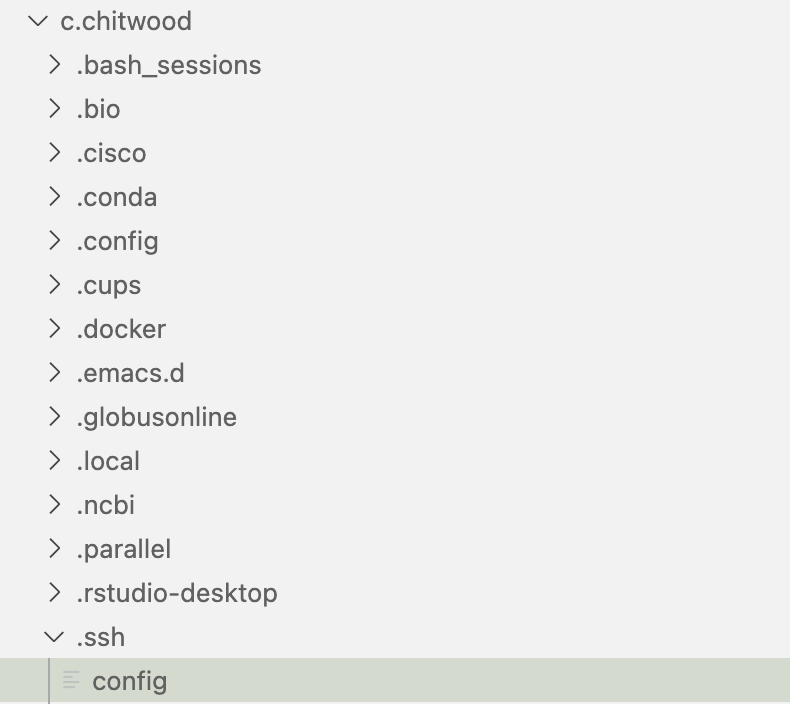

# Setting up VSCode to run Jupyter Notebooks on HTCF

## Prerequisites
- Visual Studio Code installed on your local machine
- WUSTL microsoft account login information
- Updated ~/.bashrc file on HTCF to include "code" alias

## Steps

### 1. Install Extensions
- Open VSCode on your local machine
- Go to Extensions (Shortcut: `Cmd+Shift+X`)
- Search and install the following extensions:
    - `ms-vscode-remote.remote-ssh`
    - `ms-vscode.remote-server`
    - `ms-python.python`
    - `ms-toolsai.jupyter`
      
**Note: you will need to repeat this step once you log on to HTCF. A button will appear on these extensions giving you the option to also install on the remote machine. This will install the extension to your home folder on HTCF.**

### 2. Configure SSH for Remote Connection
- Open Command Palette (Shortcut: `Cmd+Shift+P`)
- Type `Remote-SSH: Open Configuration File` and select it
- Add your SSH configuration details

### 3. Connect to Remote Server
- Open Command Palette (Shortcut: `Cmd+Shift+P`)
- Type `Remote-SSH: Connect to Host...` and select it
- Choose your configured SSH host or Add New SSH Host and type the following in the prompt:
```
ssh login.htcf.wustl.edu
``` 
- Enter your 

### 4. Open Jupyter Notebook on Remote Server
- Open Command Palette (Shortcut: `Cmd+Shift+P`)
- Type `Jupyter: Create New Blank Notebook` and select it
- Start coding in your Jupyter notebook
